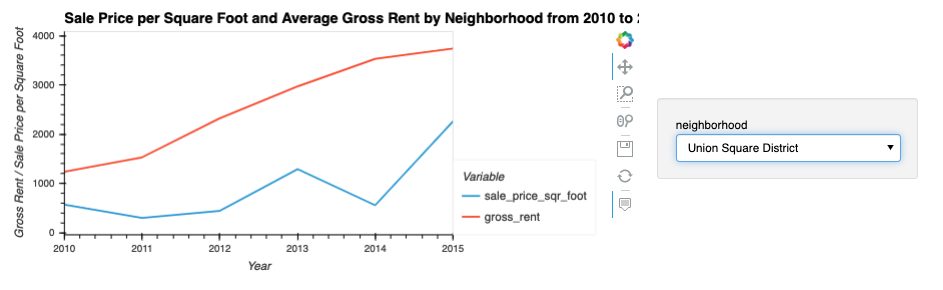
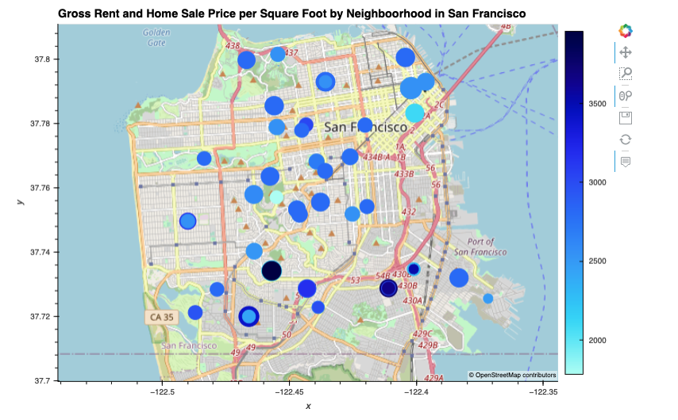

# San Francisco Housing HVPlots, Module 6 Challenge

This is a JupyterLab analysis. A data analyst can use this program to read CSV files then analyze the data. They will be able to find data by year and/or by neighborhood for the home sale prices per square foot, home sale amounts, and the gross rent cost per month. They can manipulate and plot this data to give them a good idea of what areas in San Francisco might be a good place to buy investment real estate, by to live, or seek to rent in.

---

## Technologies

This application was written in Python 3.9.12. This application is dependent on the [pandas](https://pandas.pydata.org/), [matplotlib](https://matplotlib.org/), and [JupyterLab](https://jupyter.org/), [pyviz hvplot](https://hvplot.holoviz.org/), and [pyviz geoviews](https://geoviews.org/). 

---

## Installation Guide

If you have [Anaconda](https://www.anaconda.com/products/distribution) downloaded, then pandas and JupyterLab, and matplotlib will be part of your package. You can check that they're ready to use by typing the following in your CLI terminal:
```python
conda list pandas
conda list jupyterlab
conda list matplotlib
```
You'll need to install pyviz, hvplot, and geoviews:
```python
conda install -c pyviz hvplot geoviews
```
then you can check that these were installed by entering:
```python
conda list hvplot
conda list geoviews
```

---

## Usage

Open your CLI terminal and type
```python
jupyter lab
```
then JupyterLab will automatically open in your browswer. Use the left side menu bar to search for the `san_francisco_housing.ipynb` file. Open this file. Then you can use the formaulas in the `.ipynb` file to analyze your CSV file(s) and gather the informaiton you need to determine housing areas that will work best for you and your client.

See an example of a Line Plot showing the correlation between gross rent and home sale prices per square foot by neighborhood here:



See an example of a Geoview Plot showing the correlation between gross rent and home sale prices per square foot by neighborhood on a map here:



---

## Contributors

Rachel Ann Hodson, rachelannhodson@gmail.com

---

## License

MIT
